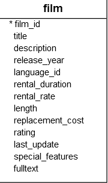

# Introduction to PostgreSQL Fetch clause

To constain the number of rows returned by a query, you often use the `LIMIT` clause. The `LIMIT` clause is wide used in many RDBMS. However, the `LIMIT` clause is not a SQL-stadard.

To conform with the `SQL` standard, PostgreSQL supports the `FETCH` clause to retreive the number of rows returned by a query.

The following illustrates the syntax of the PostgreSQL `FETCH` clause:

```sql
OFFSET start { ROW | ROWS }
FETCH { FIRST | NEXT } [ row_count ] { ROW | ROWS } ONLY
```


In this syntax:

- `ROW` is the synonym for `ROWS`, `FIRST` is the synonym for `NEXT` . SO you can use them interchangeably
- The `start` is an integer that must be zero or positive. By default, it is zero if the `OFFSET` clause is not specified. In case the `start` is greater than the number of rows in the result set, no rows are returned;
- The `row_count` is 1 or greater. By default, the default value of `row_count` is 1 if you do not specify it explicitly.


Because the order of rows stored in the table is unspecified, you should always use the `FETCH` clause with the `ORDER BY` clause to make the order of rows in the returned result set consistent.

### FETCH vs LIMIT

Let's use the `film` table in the sample database for the demonstration.



The following query use the FETCH clause to select the first film sorted by titles in ascending order:

```sql
SELECT
    film_id,
    title
FROM
    film
ORDER BY
    title 
FETCH FIRST ROW ONLY;
```

```sql
dvdrental=# select film_id, title from film fetch first row only;
 film_id |      title      
---------+-----------------
     133 | Chamber Italian
(1 row)

```

The following query use the `FETCH` clause to select the first five films sorted by titles:

```sql
SELECT
    film_id,
    title
FROM
    film
ORDER BY
    title 
FETCH FIRST 5 ROW ONLY;

```

```sql
dvdrental=# select film_id, title from film fetch first 5 row only;
 film_id |       title       
---------+-------------------
     133 | Chamber Italian
     384 | Grosse Wonderful
       8 | Airport Pollock
      98 | Bright Encounters
       1 | Academy Dinosaur
(5 rows)
```

The following statement returns the next five films after the first five fils sorted by titles:

```sql
SELECT
    film_id,
    title
FROM
    film
ORDER BY
    title 
OFFSET 5 ROWS 
FETCH FIRST 5 ROW ONLY; 

```

```sql
dvdrental=# select film_id, title from film order by film_id offset 5 rows fetch first 5 rows only;
 film_id |      title       
---------+------------------
       6 | Agent Truman
       7 | Airplane Sierra
       8 | Airport Pollock
       9 | Alabama Devil
      10 | Aladdin Calendar
(5 rows)

```

- OFFSET <number> skip the specified number of lines.