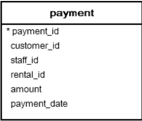

# PostgreSQL BETWEEN


- [Like >>>](110-like.md)
----------


You use the `BETWEEN` operator to match a value against a range of values. The following illustrates the syntax of the `BETWEEN` operator:

```
value BETWEEN low AND high;
```

If the `value` is greater than or equal to the `low` value and less than or equal to the `hight` value, the expression returns true, otherwise, it returns false.

You can write the `BETWEEN` operator by using the greater than or equal ( `>=` ) or less than or equal ( `<=` ) operators like this:

```
value >= low and value <= high
```

If the `value` is greater than or equal to the `low` value and less than or equal to the `high` value, the expression returns true, otherwise, it returns false.

You can rewrite the `BETWEEN` operator by using the greater than or equal ( `>=` ) or less than or equal ( `<=` ) operators like this:

```
value >= low and value <= high
```

If you want to check if a value is out of range, you can combine the `NOT` operator with the `BETWEEN` operator as follows:

```
value < low OR value > high
```

You often use the `BETWEEN` operator in the WHERE clause of a SELECT, INSERT, UPDATE, OR DELETE statement.

### PostgreSQL BETWEEN operator examples

Let's look at the `payment` table in the sample database.



the following query use the BETWEEN operator to select payments whose amount is between 8 and 9 (USD):

```sql
SELECT
	customer_id,
	payment_id,
	amount
FROM
	payment
WHERE
	amount BETWEEN 8 AND 9;
```

```
 customer_id | payment_id | amount 
-------------+------------+--------
         343 |      17517 |   8.99
         347 |      17529 |   8.99
         347 |      17532 |   8.99
         348 |      17535 |   8.99
         349 |      17540 |   8.99
         379 |      17648 |   8.99
         403 |      17747 |   8.99
         409 |      17775 |   8.99
         423 |      17817 |   8.99
         431 |      17853 |   8.99
         442 |      17886 |   8.99
```

To get payments whose amount is not in the range 8 and 9, you use the following query:

```sql
SELECT
	customer_id,
	payment_id,
	amount
FROM
	payment
WHERE
	amount NOT BETWEEN 8 AND 9;
```

```
 customer_id | payment_id | amount 
-------------+------------+--------
         341 |      17503 |   7.99
         341 |      17504 |   1.99
         341 |      17505 |   7.99
         341 |      17506 |   2.99
         341 |      17507 |   7.99
         341 |      17508 |   5.99
         342 |      17509 |   5.99
         342 |      17510 |   5.99
         342 |      17511 |   2.99
         343 |      17512 |   4.99
```

----------


If you want to check a value against of data ranges, you should use the literal data in ISO 8601 format i.e. YYYY-MM-DD. 

For example, to get the payment whose payment date is between `2007-02-07` and `2007-02-15`, you use the following query:

```sql
SELECT
	customer_id,
	payment_id,
	amount,
 payment_date
FROM
	payment
WHERE
	payment_date BETWEEN '2007-02-07' AND '2007-02-15';
```

```
 customer_id | payment_id | amount |        payment_date        
-------------+------------+--------+----------------------------
         368 |      17610 |   0.99 | 2007-02-14 23:25:11.996577
         370 |      17617 |   6.99 | 2007-02-14 23:33:58.996577
         402 |      17743 |   4.99 | 2007-02-14 23:53:34.996577
         416 |      17793 |   2.99 | 2007-02-14 21:21:59.996577
         432 |      17854 |   5.99 | 2007-02-14 23:07:27.996577
         481 |      18051 |   2.99 | 2007-02-14 22:03:35.996577
         512 |      18155 |   6.99 | 2007-02-14 22:57:03.996577
         516 |      18173 |   4.99 | 2007-02-14 21:23:39.996577
         546 |      18276 |   1.99 | 2007-02-14 23:10:43.996577
         561 |      18322 |   2.99 | 2007-02-14 23:52:46.996577
         592 |      18441 |   6.99 | 2007-02-14 21:41:12.996577
```

[Like >>>](110-like.md)