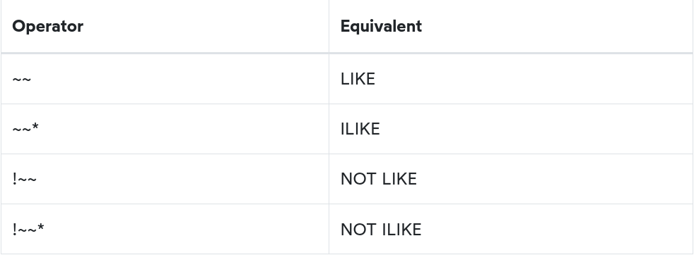

# PostgreSQL Like

- [NULL >>>](111-is-null.md)
----------


### Introduction to PostgreSQL LIKE operator

Suppose that you want to find a customer, but you don't remember her name exactly. However, you can recall that her name begins with something like `Jen`.

How do you find the exact customer from the database? You may find the customer in the `customer` table by looking at the first name column to see if there is any value that begins with `Jen`. However, this process can be time-consuming if the customer table has a large number of rows.

Fortunately, you can use the PostgreSQL `LIKE` operator to match the first name of the customer with a string using the following query:

```sql
SELECT
	first_name,
        last_name
FROM
	customer
WHERE
	first_name LIKE 'Jen%';
```

```
 first_name | last_name 
------------+-----------
 Jennifer   | Davis
 Jennie     | Terry
 Jenny      | Castro
```

Notice that the `WHERE` clause contains a special expression: the `first_name`, the `LIKE` operator and a string that contains a percent sign ( `%` ). The string `Jen%` is called a pattern.

The query returns rows whose value in the first_name column begin with `Jen` and may be following by any sequence of characters. This technique is called pattern matching.

You constract a pattern by combining literal values with wildcard characters and use the `LIKE` or `NOT LIKE` operator to find the matches. PostgreSQL provides you with two wildcards:

- Percent sign ( `%` ) matches any sequence of zero or more characters.
- Underscore sign ( `_` ) matches any single character.

The syntax of PostgreSQL `LIKE` operator is as follows:

```
value LIKE pattern
```

The expression returns true if the `value` matches the `pattern`.

To negate the `LIKE` operator, you use the `NOT` operator as follows:

```
value NOT LIKE pattern
```

The `NOT LIKE` operator returns true when the `value` does not match the `pattern`.

If the pattern does not contain any wildcard character, the `LIKE` operator behaves like the equal ( `=` ) operator.

### PostgreSQL LIKE operator - pattern matching examples

Let's take some examples of using the `LIKE` operator

#### Simple PostgreSQL LIKE examples

See the following example:

```sql
SELECT
	'foo' LIKE 'foo', -- true
	'foo' LIKE 'f%', -- true
	'foo' LIKE '_o_', -- true
	'bar' LIKE 'b_'; -- false
```

How it works:

- The first expression returns true because the `foo` pattern does not contain any wildcard character so the `LIKE` operator acts like the equal ( `=` ) operator.
- The second expression returns true because it matches any string that begins with the letter `f` and following by any number of characters.
- The third expression returns true because the pattern ( `_o_` ) matches any string that begins with any single character, followed by the letter `o` and ended with any single character.
- The fourth expression return false because the pattern `b_` matches any string that begins with the letter `b` and followed by any single character.

----------

It's possible to use wildcards at the begining and/or end of the problem.

For example, the following query returns customers whose first name contains `er` string like `Jenifer`, `Kimberly`, etc.


```sql
SELECT
	first_name,
        last_name
FROM
	customer
WHERE
	first_name LIKE '%er%'
ORDER BY 
        first_name;
```

```
 first_name  |  last_name  
-------------+-------------
 Albert      | Crouse
 Alberto     | Henning
 Alexander   | Fennell
 Amber       | Dixon
 Bernard     | Colby
 Bernice     | Willis
 Bertha      | Ferguson
 Beverly     | Brooks
 Catherine   | Campbell
 Cheryl      | Murphy
 Chester     | Benner
 Christopher | Greco
```

----------


You can combine the percent ( `%` ) with underscore ( `_ ` ) to construct a pattern as the following example:

```sql
SELECT
	first_name,
	last_name
FROM
	customer
WHERE
	first_name LIKE '_her%'
ORDER BY 
        first_name;
```

```
 first_name | last_name 
------------+-----------
 Cheryl     | Murphy
 Sherri     | Rhodes
 Sherry     | Marshall
 Theresa    | Watson
```

The pattern `_her%` matches any string that:

- Begin with any single character ( `-` )
- And is followed by the literal string `her`.
- And is ended with any number of characters.

The returned first name are C**her**yl, S**her**ri, S**her**ry, and T**her**asa.

### PostgreSQL NOT LIKE examples

The following query uses the `NOT LIKE` operator to find customers whose first names do no begin with `Jen`:

```sql
SELECT
	first_name,
	last_name
FROM
	customer
WHERE
	first_name NOT LIKE 'Jen%'
ORDER BY 
    first_name
```

```
 first_name  |  last_name   
-------------+--------------
 Aaron       | Selby
 Adam        | Gooch
 Adrian      | Clary
 Agnes       | Bishop
 Alan        | Kahn
 Albert      | Crouse
 Alberto     | Henning
 Alex        | Gresham
 Alexander   | Fennell
 Alfred      | Casillas
 Alfredo     | Mcadams
 Alice       | Stewart
```

### PostgreSQL extensions of LIKE operator


PostgreSQL supports the `ILIKE` operator that works like the `LIKE` operator. In addition, the `ILIKE` operator matches value case-insensitively. For example:

```sql
SELECT
	first_name,
	last_name
FROM
	customer
WHERE
	first_name ILIKE 'BAR%';
```

```
 first_name | last_name 
------------+-----------
 Barbara    | Jones
 Barry      | Lovelace
```

The  `BAR%` pattern matches any string that begins with `BAR`, `Bar`, `BaR`, etc. If you use the `LIKE` operator instead, the query will not return any row.

PostgreSQL also provides some operators that act like the `LIKE`, `NOT LIKE`, `ILIKE` and `NOT ILIKE` operator as shown below:



[NULL >>>](111-is-null.md)