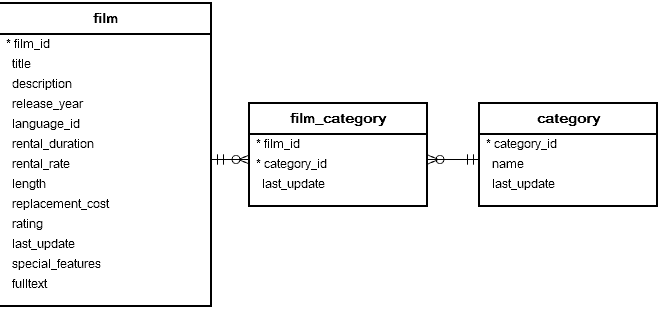

# Drop View

### Introduction to PostgreSQL DROP VIEW statement

The `DROP VIEW` statement removes a view from the database. The following illustrates the syntax of the `DROP VIEW` statement;

```sql
DROP VIEW [IF EXISTS] view_name
[CASCADE | RESTRICT]
```

In this syntax:

- First, specify the name of the view after the `DROP VIEW` keywords.
- Second, use the `IF EXISTS` option to drop a view only it it exists. If you don't use the `IF EXISTS` option and drop a view that does not exists, PostgreSQL will issue an error. However, if you use the `IF EXISTS` option, PostgreSQL issues a notice instead.
- Third, use the `RESTRICT` option to reject the removal of the view if there are any objects depending on it. The `RESTRICT` option is the default. If you use the `CASCADE` option, the `DROP VIEW` automatically drops objects that depend on view and all objects that depend on those objects.

To remove multiple views using a single statement, you specify a comma separated list of view name after the `DROP VIEW` keywords like this:

```sql
DROP VIEW [IF EXISTS] view_name1, view_name2, ...;
```

To execute the `DROP VIEW` statement, you must be the owner of the view.


### PostgreSQL DROP VIEW statement examples

See the following `film`, `film_category`, and `category` table from the sample database:



Let's create new views for practising.

The following statement creates a view based on the information from those tables:

```sql
CREATE VIEW film_master 
AS
SELECT 
	film_id, 
	title, 
	release_year, 
	length, 
	name category
FROM 
	film
INNER JOIN film_category 
	USING (film_id)
INNER JOIN category 
	USING(category_id);
```

The following statement creates a view called `horror_film` based on the `film_master` view:

```sql
CREATE VIEW horror_film 
AS
SELECT 
	film_id, 
	title, 
	release_year, 
	length 
FROM 
	film_master
WHERE 
	category = 'Horror';
```

And the following statement creates also a view called `comedy_film` based on the `film_master` view:

```sql
CREATE VIEW comedy_film 
AS
SELECT 
	film_id, 
	title, 
	release_year, 
	length 
FROM 
	film_master
WHERE 
	category = 'Comedy';
```

The following statement creates a view that returns the number of films by category:

```sql
CREATE VIEW film_category_stat
AS
SELECT 
	name, 
	COUNT(film_id) 
FROM category
INNER JOIN film_category USING (category_id)
INNER JOIN film USING (film_id)
GROUP BY name;
```

The following creates a view that returns the total length of films for each category:

```sql
CREATE VIEW film_length_stat
AS
SELECT 
	name, 
	SUM(length) film_length
FROM category
INNER JOIN film_category USING (category_id)
INNER JOIN film USING (film_id)
GROUP BY name;
```

### 1) Using PostgreSQL DROP VIEW to drop one view

The following example uses the `DROP VIEW` statement to drop the `comedy_film` view:

```sql
DROP VIEW comedy_film;
```

### 2) Using PostgreSQL DROP VIEW statement to drop a view that has dependent objects


The following statement uses the `DROP VIEW` statement to drop the `film_master` view:

```sql
DROP VIEW film_master;
```

PostgreSQL issued an error:

```sql
ERROR:  cannot drop view film_master because other objects depend on it
DETAIL:  view horror_film depends on view film_master
HINT:  Use DROP ... CASCADE to drop the dependent objects too.
SQL state: 2BP01
```

The `film_master` has a dependent object which is the view `horror_film`.

To drop the view `film_master`, you need to drop its dependent object first or use the `CASCADE` option like this:

```sql
DROP VIEW film_master 
CASCADE;
```

This statement drops the `film_master` view as well as its dependent object which is the `horror_film`. It issued the following notice:

```sql
NOTICE:  drop cascades to view horror_film
```

### 3) Using PostgreSQL DROP VIEW to drop multiple views


The following statement uses a single `DROP VIEW` statement to drop multiple views:

```sql
DROP VIEW film_length_stat, film_category_stat;
```
