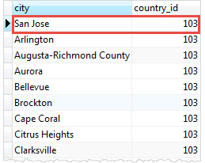

# Creating PostgreSQL Updatable Views

- [<<< Drop Views](102-drop-views.md) | [Materialized Views >>>](104-materialized-view.md)

----------


A PostgreSQL view is updatable when it meets the following conditions:


- The defining query of the view must have exactly one entry in the `FROM` clause, which can be a table or another updatable view.
- The defining query must not contain one of the following clauses at the top level: `GROUP BY`, `HAVING`, `LIMIT`, `OFFSET`, `DISTINCT`, `WITH`, `UNION`, `INTERSECT`, and `EXCEPT`.
- The selection list must not contain any `window function` , any `set-returning function`, or any `aggregate function` such as `SUM`, `COUNT`, `AVG`, `MIN`, and `MAX`.

An updatable view may contain both updatable and non-updatable columns. If you try to insert or update a non-updatable column, PostgreSQL will raise an error.


When you execute an update operation such as `INSERT`, `UPDATE` or `DELETE`, PosgreSQL will convert this statement into the corresponding statement of the underlying table.

In case you have a `WHERE` condition in the defining query of a view, you still can update or delete the rows that are not visible through the view. However, if you want to avoid this, you can use `CHECK OPTION` when you define the view.

When you perform update operations, you must have corresponding privilege on the view, but you don’t need to have privilege on the underlying table. However, view owners must have the relevant privilege of the underlying table.


### PostgreSQL updatable views example

First, create a new updatable view name `usa_cities` using `CREATE VIEW` statement. This view contains all cities in the `city` table locating in the USA whose country id is 103.

```sql
CREATE VIEW usa_cities AS SELECT
	city,
	country_id
FROM
	city
WHERE
	country_id = 103;
```

Next, check the data in the `use_cities` view by executing the following `SELECT` statement:

```sql
SELECT
	*
FROM
	usa_cities;
```

Then, insert a new city to the `city` table through the `use_cities` view using the following `INSERT` statement:

```sql
INSERT INTO usa_cities (city, country_id)
VALUES('San Jose', 103);
```

After that, check the contents of the `city` table:

```sql
SELECT
	city,
	country_id
FROM
	city
WHERE
	country_id = 103
ORDER BY
	last_update DESC;
```

We have a newly entry added to the city table.



Finally, delete the entry that has been added through the `use_cities` view.

```sql
DELETE
FROM
	usa_cities
WHERE
	city = 'San Jose';
```

The entry has been deleted from the `city` table through the `use_cities` view.

----------

[<<< Drop Views](102-drop-views.md) | [Materialized Views >>>](104-materialized-view.md)